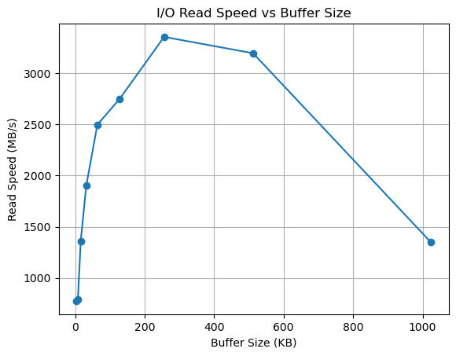
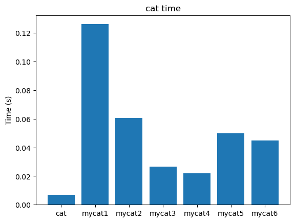

# Report

### 任务三

1. ##### 为什么内存页对齐能提高性能？

  减少TLB Miss：对齐后单个缓冲区不会跨页，减少地址转换开销

  预取优化：CPU缓存行预取对齐内存更高效

2. ##### 为什么 malloc 不能保证页对齐？

  malloc 的设计目标是通用内存分配，需兼顾小内存块效率。内存池管理会添加头部信息（如块大小），破坏原始对齐

3. ##### 如何正确释放内存？

  存储原始指针：在返回的对齐指针前隐藏存储 malloc 返回的原始地址

  偏移量计算：释放时通过 ((void**)ptr)[-1] 取回原始指针

### 任务四

1. ##### 为什么在设置缓冲区大小的时候需要考虑到文件系统块的大小的问题？

   减少I/O碎片：匹配文件系统块大小可避免"read-modify-write"操作

   预读优化：文件系统按块预读数据，对齐后利用率更高

   DMA效率：直接内存访问需要块对齐


2. ##### 对于上面提到的两个注意事项你是怎么解决的？

   动态检测每个文件的块大小：

   使用 `stat()` 系统调用获取 `st_blksize`

   对每个文件单独计算缓冲区大小

   验证块大小有效性：

```c
// 检查是否为2的幂
if ((block_size & (block_size - 1)) != 0) {
    block_size = 4096; // 回退默认值
}
```

### 任务五



##### 设计思路说明

1.目标
测试不同缓冲区（buffer）大小下，顺序读取大文件的速度，分析缓冲区大小对I/O性能的影响，找出最佳缓冲区大小的经验范围。
步骤分解
2.生成测试文件
首先用 os.urandom 生成一个固定大小（如100MB）的二进制文件，确保每次测试的数据量一致，避免因文件太小导致测试不准确。
设置不同的缓冲区大小
选取一组常见的缓冲区大小（如4KB、8KB、16KB、32KB、64KB、128KB、256KB、512KB、1MB），这些值覆盖了从操作系统页大小到常见大块I/O的范围。
逐个缓冲区大小测试读取速度
对每种缓冲区大小，循环读取整个文件，记录读取所用的总时间。通过 file.read(buf_size) 控制每次读取的数据量，模拟不同缓冲区下的I/O行为。
3.计算吞吐量
用文件总大小除以耗时，得到每种缓冲区下的读取速度（MB/s），用于后续分析。
4.结果可视化
用 matplotlib 画出“缓冲区大小 vs 读取速度”的曲线，直观展示缓冲区大小对I/O性能的影响，便于找到性能提升的拐点。

### 任务六

##### 1. 你是如何设置fadvise的参数的？

在mycat6.c中，我使用了posix_fadvise系统调用来优化文件读取。具体做法是在打开文件后、开始读数据前，调用：

```c
posix_fadvise(fd, 0, 0, POSIX_FADV_SEQUENTIAL);
```

- fd：文件描述符

- 0, 0：表示从文件开头到结尾

- POSIX_FADV_SEQUENTIAL：告诉操作系统“我会顺序读取这个文件”

这样，操作系统可以根据顺序读取的预期，提前进行数据预取（readahead），减少I/O等待。

##### 2. 对于顺序读写的情况，文件系统可以如何调整readahead？对于随机读写的情况呢？

- 顺序读写（POSIX_FADV_SEQUENTIAL）：操作系统会检测到应用程序以顺序方式访问文件，于是会自动增大readahead窗口（即一次性预读更多数据到内存缓存），这样后续read操作大概率能直接命中缓存，减少磁盘I/O等待，提高吞吐量。

- 随机读写（POSIX_FADV_RANDOM）：如果设置为POSIX_FADV_RANDOM，操作系统会认为应用程序的访问模式是随机的，不会进行预读（readahead），以避免无谓的磁盘I/O和缓存污染。这样可以节省内存和I/O资源，适合数据库等场景
- 合理设置fadvise参数，可以让操作系统根据实际访问模式优化I/O调度策略，从而提升整体性能。

### 任务七



- 性能趋势

从柱状图可以看出，最朴素的mycat1（每次读写1字节）性能最差，耗时最长。随着缓冲区的引入和优化（mycat2~mycat5），性能有了大幅提升，耗时显著减少。

当缓冲区大小设置为页大小、文件系统块大小的整数倍，或者实验得出的最优倍数后，性能基本达到瓶颈，继续增大缓冲区提升有限。

- 对齐与fadvise的作用

页对齐（mycat3）和合理的缓冲区倍数（mycat5）能让I/O更高效。fadvise（mycat6）在顺序读场景下进一步优化了readahead，但在后续优化时，提升有限。

- 与系统cat对比

系统自带的cat通常有最优的实现，综合了多种优化手段。我们的实验版本在合理优化后，性能相比原来已大大接近系统cat。

- 启示

1. I/O缓冲区的合理设置是提升大文件处理性能的关键。
2. 实验驱动的参数选择比盲目套用经验值更科学。